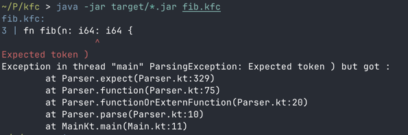

# Simple Compiler for ARM64

A hobby project exploring compiler development, targeting Apple Silicon (ARM64) architecture.

## Overview

This compiler takes a custom high-level language and translates it into ARM64 assembly code. The language is designed to be simple yet expressive, while still being easy to implement.

## Features

The current implementation supports:

- Basic arithmetic operations
- Function calls (including recursion)
- Variable declarations
- Conditional statements
- Loops
- Integration with C functions
- Friendly parse and type errors

## Usage

### Building the Compiler
```sh
mvn clean package
java -jar target/*.jar
```

### Example
Calculating the 10th fibonacci number and printing the result:  
```kotlin
extern fn printInt(i64): unit;

fn fib(n: i64): i64 {
  if (n == 0 || n == 1) {
    return 1;
  }
  return fib(n-1) + fib(n-2);
}

fn main(): bool {
  let result: i64 = fib(10);
  printInt(result);
  if (result == 720) {
    return true;
  }
  return false;
}
```  

Calculating 6! and printing the result:  
```kotlin
extern fn printInt(i64): unit;

fn fac(n: i64): i64 {
    let result: i64 = 1;
    let i: i64 = 2;
    while (i < n+1) {
      result *= i;
      i += 1;
    }
    return result;
}

fn main(): bool {
  let result: i64 = fac(6);
  printInt(result);
  if (result == 720) {
    return true;
  }
  return false;
}
```  

To run one of the examples on a Macbook:  
```sh
java -jar target/*.jar fib.kfc
as -o fib.o fib.s
gcc lib.c -o lib.o
ld fib.o lib.o -lSystem -syslibroot /Applications/Xcode.app/Contents/Developer/Platforms/MacOSX.platform/Developer/SDKs/MacOSX.sdk
./a.out
```

## Parsing errors


## Limitations
The current implementation has several limitations:

- No string support
- No garbage collection
- No array or object support

I might add those in the future.
